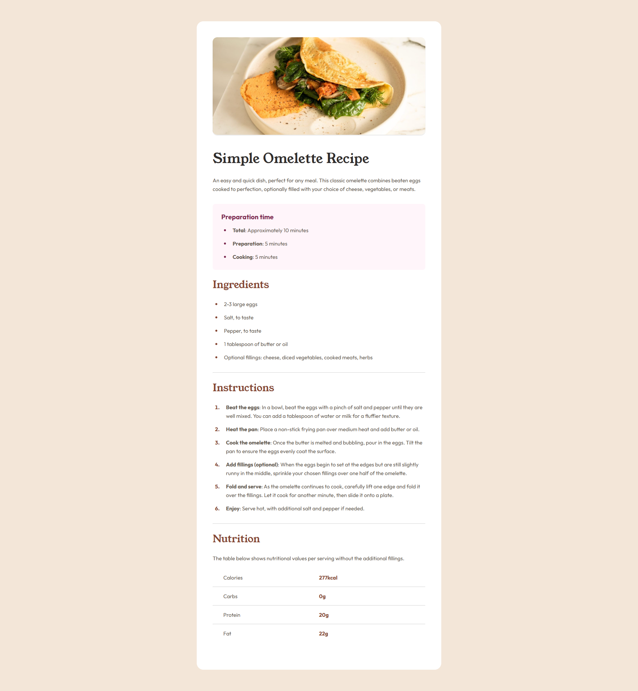

  

  <h2>Recipe page</h2>

  <h3>
    <a href="https://www.frontendmentor.io/solutions/rest-countries-api-with-color-theme-switcher-2eiA_NNDs-">
      <strong>Frontend Mentor</strong>
    </a>
  </h3>

   

  

    <a href="https://rest-countries-api-with-color-theme-switcher-weld.vercel.app/">View Demo</a>
    -
    <a href="https://github.com/JenaCarry/rest-countries-api-with-color-theme-switcher/issues">Report Bug</a>
    -
    <a href="https://github.com/JenaCarry/rest-countries-api-with-color-theme-switcher/pulls">Request Feature</a>
  

#

This is a solution to the [Recipe page challenge on Frontend Mentor](https://www.frontendmentor.io/challenges/recipe-page-KiTsR8QQKm). Frontend Mentor challenges help you improve your coding skills by building realistic projects.

<h2>Links</h2>

-   Solution URL: [Recipe page | Frontend Mentor](https://www.frontendmentor.io/solutions/rest-countries-api-with-color-theme-switcher-2eiA_NNDs-)
-   Live Site URL: [https://rest-countries-api-with-color-theme-switcher-weld.vercel.app/](https://rest-countries-api-with-color-theme-switcher-weld.vercel.app/)

 

## Table of contents

- 
  - [Table of contents](#table-of-contents)
  - [Overview](#overview)
    - [Screenshot](#screenshot)
  - [My process](#my-process)
    - [Built with](#built-with)
  - [Author](#author)

## Overview

### Screenshot

## My process

### Built with

-   Semantic HTML5 markup
-   CSS custom properties
-   Flexbox
-   CSS Grid
-   Mobile-first workflow

## Author

-   Frontend Mentor - [@JenaCarry](https://www.frontendmentor.io/profile/JenaCarry)
-   LinkedIn - [Jean Dias](https://www.linkedin.com/in/jean-dias-0900a1260/)
